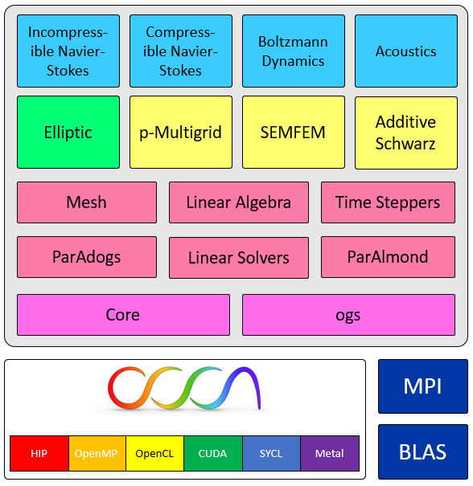

[](https://codecov.io/gh/paranumal/libparanumal)
[](https://zenodo.org/badge/latestdoi/142787012)

## libParanumal
An experimental set of finite element flow solvers for heterogeneous (GPU/CPU) systems. The initial development of libParanumal was performed by the [Parallel Numerical Algorithms Group at Virginia Tech](http://paranumal.com).

libParanumal is funded in part by the US Department of Energy as part of the activities of the [Center for Efficient Exscale Discretizations](http://ceed.exascaleproject.org).

Why is it called libParanumal?: the high-order finite-element implementations in libParanumal are __spectrally__ accurate and rely heavily on __ghost__ elements for MPI communications.

### 1. How to cite the libParanumal project:
If you use any part of libParanumal in your research project including variants on the included compute kernels please use the following bibliographical reference:

<pre>
@MISC{ChalmersKarakusAustinSwirydowiczWarburton2020,
      author = "Chalmers, N. and Karakus, A. and Austin, A. P. and Swirydowicz, K. and Warburton, T.",
      title = "{libParanumal}: a performance portable high-order finite element library",
      year = "2022",
      url = "https://github.com/paranumal/libparanumal",
      doi = "10.5281/zenodo.4004744",
      note = "Release 0.5.0"}
</pre>

see the [references](#10-references) section below for additional papers to reference about various aspects of the library.

---
### 2. How you can help out:
libParanumal is a community project. Please help improve the library by submitted an [Issue](https://github.com/paranumal/libparanumal/issues)  if you notice any unexpected behavior, discover a bug, have problems installing/running/trouble shooting your installation. It benefits us as a community when issues and feature requests are shared so that we can understand how to improve the library.

Please submit feature requests as an [Issue](https://github.com/paranumal/libparanumal/issues) for the consideration of all contributors. Likewise if you wish to submit a code change please make a GitHub [Pull Request](https://github.com/paranumal/libparanumal/pulls).

---
### 3. Overview

Brief summary of major features:

A. Supported elements:
  - Triangles, quadrilaterals, tetrahedra, hexahedra.
  - Lagrange basis functions.

B. Mesh wrangling:
  - Gmsh format file loaders.
  - Load balanced inertial partitioning.
  - Load balanced multi-level spectral partitioning.
  - Cuthill-Mckee local ordering

C. Time integrators:
  - Adaptive rate Dormand-Prince order 5 Runge-Kutta.
  - Low storage explicit Runge-Kutta order 4.
  - Single and Multirate Adams-Bashforth order 3.
  - Extrapolated Backwards Differencing order 3.

D. Iterative linear solvers:
  - Preconditioned (flexible) Conjugate Gradient method.
  - Non-blocking Preconditioned (flexible) Conjugate Gradient method.
  - Preconditioned (Generalized) Minimal Residual Method.
  - Improved initial guess techniques (History Projection/Extrapolation). 

E. Elliptic solver:
  - Linear Poisson and screened Poisson potential solvers.
  - GPU-optimized matrix-vector products.
  - p-type multigrid, algebraic multigrid (smoothed and unsmoothed aggregation), low-order SEMFEM, Overlapping Additive Schwarz, and Jacobi preconditioning.
  - Matrix-free p-multigrid for fine levels of multigrid hierarchy.

F. Heterogeneous accelerated flow solvers:
  - Compressible Navier-Stokes solver with:
     * Upwind discontinuous Galerkin discretization in space.
     * Optional isothermal equation of state.
  - Galerkin-Boltzmann gas dynamics solver with:
     * Penalty flux DG discretization in space.
     * Adaptive semi-analytic (pointwise exponential) integration in time.
     * Multiaxial quasi-perfectly matched absorbing layer far field boundary condition.
  - Incompressible Navier-Stokes solver with:
     * Choice of continuous FEM or interior penalty DG in space.
     * Extrapolation-BDF integration in time.
     * Sub-cycling (Operator Integration Factor Splitting) for advection.

G. Portability:
  - Ships with the Open Concurrent Compute Abstraction (OCCA)
  - At build time, OCCA will try to detect if any of these execution models are installed: OpenMP, CUDA, OpenCL, HIP, and/or SYCL.
  - Execution model can be selected at runtime. 
    - If OCCA does not detect a chosen mode of execution it will default to Serial execution.
    - You will need to adjust the libParnumal setup input files to choose the execution model and compute device appropriate for your system.
      
H. Dependencies:
   - Message Passing Interface (MPI v3.0 or higher).
      * The libParanumal makefiles assume that mpic++ is installed and visible in your path.
   


---
### 4. Code block diagram


---
### 5. OCCA dependency
OCCA is held as a git submodule inside libParanumal. If you did not clone with `--recursive` then run the following commands before building.
```
git submodule init
git submodule update
```

---
### 6. Required Libraries
libParanumal requires installed BLAS and LAPACK libraries. By default, the build system will look for a serial (i.e. non-threaded) OpenBLAS in your default library search paths. The BLAS and LAPACK library paths can also be manually specified in `make.top` with the `LIBP_BLAS_DIR` and `LIBP_BLAS_LIB` variables.

Some Linux distributions will package a serial OpenBLAS library. For example, on Ubuntu systems this libraries can be installed via
```
sudo apt install libopenblas-serial-dev
```

---
### 7. Clone: libParanumal
```
git clone --recursive https://github.com/paranumal/libparanumal
```

#### 7-1. Build all libParanumal solvers
```
cd libparanumal
make -j `nproc`
```

---
### 8. Running the codes:

Each solver resides in its respective sub-directory in `solvers/`. Each solver sub-directory includes makefile, src directory, data directory (including header files for defining boundary conditions), okl kernel directory, and setups directory. The setups directory includes a number of example input files that specify input parameters for the solver.

#### 8-1. Build libParanumal elliptic solver

```
cd libparanumal/solvers/elliptic
make -j `nproc` 
```

#### 8-2. Run elliptic example with provided quadrilateral set up file on a single device:

libParanumal will make use of extra CPU cores if available. It is therefore beneficial to bind the MPI process to several CPU cores, if possible. For example, running the libParanumal elliptic solver with OpenMPI on a system with 16 CPU cores can be done via

```
mpiexec -np 1 --map-by slot:PE=16 ./ellipticMain setups/setupQuad2D.rc
```

The number of CPU cores used can also be controlled with the `OMP_NUM_THREADS` environment variable. libParanumal will not use more threads then there are physical CPU cores on the system, however, even in the presence of this environment variable.

#### 8-3. Run the same example with four devices:

As the number of MPI processes per system increases, it is advisable to reduce the number of CPU cores per process to avoid oversubscribing the CPU cores. Using the same example above of the libParanumal elliptic solver with OpenMPI on a system with 16 CPU cores, a four rank run could be done via

```
mpiexec -np 4 --map-by slot:PE=4 ./ellipticMain setups/setupQuad2D.rc
```

i.e. each process binds to four of the 16 CPU cores available.

---

### 9. License

The MIT License (MIT)

Copyright (c) 2017-2022 Tim Warburton, Noel Chalmers, Jesse Chan, Ali Karakus

Permission is hereby granted, free of charge, to any person obtaining a copy
of this software and associated documentation files (the "Software"), to deal
in the Software without restriction, including without limitation the rights
to use, copy, modify, merge, publish, distribute, sublicense, and/or sell
copies of the Software, and to permit persons to whom the Software is
furnished to do so, subject to the following conditions:

The above copyright notice and this permission notice shall be included in all
copies or substantial portions of the Software.

THE SOFTWARE IS PROVIDED "AS IS", WITHOUT WARRANTY OF ANY KIND, EXPRESS OR
IMPLIED, INCLUDING BUT NOT LIMITED TO THE WARRANTIES OF MERCHANTABILITY,
FITNESS FOR A PARTICULAR PURPOSE AND NONINFRINGEMENT. IN NO EVENT SHALL THE
AUTHORS OR COPYRIGHT HOLDERS BE LIABLE FOR ANY CLAIM, DAMAGES OR OTHER
LIABILITY, WHETHER IN AN ACTION OF CONTRACT, TORT OR OTHERWISE, ARISING FROM,
OUT OF OR IN CONNECTION WITH THE SOFTWARE OR THE USE OR OTHER DEALINGS IN THE
SOFTWARE.

### 10. References

Entroy Stable DG schemes for compressible Navier-Stokes (cns): [arXiv version](https://arxiv.org/abs/2011.11089): `Chan, J., Lin, Y. and Warburton, T., 2020. Entropy stable modal discontinuous Galerkin schemes and wall boundary conditions for the compressible Navier-Stokes equations.`

Initial Guesses for Sequences of Linear Systems: [arXiv version](https://arxiv.org/abs/2009.10863): `Austin, A.P., Chalmers, N. and Warburton, T., 2020. Initial Guesses for Sequences of Linear Systems in a GPU-Accelerated Incompressible Flow Solver.`

Portable Streaming kernels: [arXiv version](https://arxiv.org/abs/2009.10917): `Chalmers, N. and Warburton, T., 2020. Portable high-order finite element kernels I: Streaming Operations.`

Massive parallel nodal DG simulator for (acoustics): [preprint](https://infoscience.epfl.ch/record/279868/files/hpc-20-0135.pdf): `Melander, A., Strøm, E., Pind, F., Engsig-Karup, A., Jeong, C.H., Warburton, T., Chalmers, N., and Hesthaven, J.S., 2020. Massive parallel nodal discontinuous Galerkin finite element method simulator for room acoustics.`

Scalability of high-performance PDE solvers: [publisher](https://journals.sagepub.com/doi/10.1177/1094342020915762), [arXiv version](https://arxiv.org/abs/2004.06722): `Fischer, P., Min, M., Rathnayake, T., Dutta, S., Kolev, T., Dobrev, V., Camier, J.S., Kronbichler, M., Warburton, T., Swirydowicz, K. and Brown, J., 2020. Scalability of high-performance PDE solvers, 
The International Journal of High Performance Computing Applications, Vol 34, Issue 5, Pages 562-586.`

Discontinuous Galerkin Boltzmann (bns) solver: [publisher](https://doi.org/10.1016/j.jcp.2019.03.050), [arXiv version](https://arxiv.org/abs/1805.02082): `Karakus, A., Chalmers, N., Hesthaven, J.S. and Warburton, T., 2019. Discontinuous Galerkin Discretizations of the Boltzmann Equations in 2D: semi-analytic time stepping and absorbing boundary layers, Journal of Computational Physics, Volume 390, Pages 175–202.`

Incompressible Navier-Stokes (discontinuous) Galerkin (ins) solver: [publisher](https://doi.org/10.1016/j.jcp.2019.04.010), [arXiv version](https://arxiv.org/abs/1801.00246): `Karakus, A., Chalmers, N., Swirydowicz, K. and Warburton, T., 2019. A GPU accelerated discontinuous Galerkin incompressible flow solver, Journal of Computational Physics, Volume 390, Pages 380–404, 2019.`

Optimization of elliptic mat-vec operations for (elliptic) solver on hexes: [publisher](https://doi.org/10.1177/1094342018816368), [arXiv version](https://arxiv.org/abs/1711.00903): `Swirydowicz, K., Chalmers, N., Karakus, A., and Warburton, T. 2019. Acceleration of tensor-product operations for high-order finite element methods, The International Journal of High Performance Computing Applications, Vol 33, Issue 4.`

Low-order preconditioning of triangular elements (elliptic precon): [publisher](https://epubs.siam.org/doi/abs/10.1137/17M1149444): `Chalmers, N. and Warburton, T. 2018. Low-order preconditioning of high-order triangular finite elements, SIAM Journal on Scientific Computing, Vol 40, Issue 6, Pages A4040-A4059`

### 11. Technical Reports

CEED MS38: [link](https://doi.org/10.5281/zenodo.6475857): `Kolev, T., Fischer, P., Abdelfattah, A.,  Beams, N.,  Brown, J.,  Camier, J.-S., Carson, R., Chalmers, N.,  Dobrev, V.,  Dudouit, Y.,  Ghaffari, L., Joshi, A. Y., Kerkemeier, S., Lan, Y.-H., McDougall, D., Medina, D.,  Min, M., Mishra, A.,  Pazner, W., Phillips, M.,  Ratnayaka, T., Shephard, M. S., Siboni, M. H.,  Smith, C. W.,  Thompson, J. L., Tomboulides, A.,  Tomov, S., Tomov, V., Warburton, T., 2022. ECP Milestone Report: High-order algorithmic developments and optimizations for more robust exascale applications, WBS 2.2.6.06, Milestone CEED-MS38.`

CEED MS37: [link](https://doi.org/10.5281/zenodo.5542244): `Kolev, T., Fischer, P.,  Beams, N.,  Brown, J.,  Camier, J.-S., Chalmers, N.,  Dobrev, V.,  Dudouit, Y., Kerkemeier, S., Lan, Y.-H., Lin, Y., Lindquist, N., McDougall, D., Medina, D., Merzari, E.,  Min, M., Moe, S.,  Pazner, W., Phillips, M.,  Ratnayaka, T., Rowe, K., Shephard, M. S.,  Smith, C. W.,  Tomov, S., Warburton, T., 2022. CEED ECP Milestone Report: Port and optimize the CEED software stack to Aurora / Frontier EA Systems, WBS 2.2.6.06, Milestone CEED-MS37.`

CEED MS36: [link](https://doi.org/10.5281/zenodo.4672664): `Kolev, T., Fischer, P., Austin, A.P., Barker, A.T., Beams, N.,   Brown, J., Camier, J.-S., Chalmers, N.,   Dobrev, V., Dudouit, Y.,  Ghaffari, L., Kerkemeier, S.,  Lan, Y.-H., Merzari, E.,  Min, M.,   Pazner, W., Ratnayaka, T., Shephard, M. S., Siboni, M.H.,   Smith, C.W.,   Thompson, J.L.,   Tomov, S., Warburton, T., 2021. ECP Milestone Report: High-order algorithmic developments and optimizations for large-scale GPU-accelerated simulations, WBS 2.2.6.06, Milestone CEED-MS36.`

CEED MS35: [link](https://doi.org/10.5281/zenodo.4146400): `Kolev, T., Fischer, P.,  Abdelfattah, A.,  Barra, V.,  Beams, N.,  Brown, J., Camier, J.S., Chalmers, N.,  Dobrev, V., Kerkemeier, S., Lan, Y.H., Merzari, E.,  Min, M., Phillips, M., Ratnayaka, T., Rowe, K.,  Thompson, J., Tomboulides, A.,  Tomov, S., Tomov, V,. and Warburton, T., 2020. ECP Milestone Report: Support CEED-enabled ECP applications in their preparation for Aurora/Frontier, WBS 2.2.6.06, Milestone CEED-MS35.`

CEED MS34: [link](https://doi.org/10.5281/zenodo.3860803): `Kolev, T., Fischer, P.,  Abdelfattah, A., Ananthan, S.,  Barra, V.,  Beams, N., Bleile, R.,  Brown, J., Carson, R,. Camier, J.S., Churchfield, M.,  Dobrev, V., Dongarra, J., Dudouit, Y., Karakus, A., Kerkemeier, S., Lan, Y., Medina, D., Merzari, E., Min, M., Parker, S., Ratnayaka, T.,  Smith, C., Sprague, M., Stitt, T.,  Thompson, J., Tomboulides, A.,  Tomov, S., Tomov, V., Vargas, A., Warburton, T., and Weiss, K., 2020. ECP Milestone Report: Improve performance and capabilities of CEED-enabled ECP applications on Summit/Sierra, WBS 2.2.6.06, Milestone CEED-MS34.`

CEED MS29: [link](https://doi.org/10.5281/zenodo.3336419): `Shephard, M.,  Barra, V.,  Brown, J., Camier, J.S., Dudouit, Y., Fischer, P.,  Kolev, T., Medina, D., Min, M., Smith, C., Siboni, M.H., Thompson, J., and Warburton, T., 2019. ECP Milestone Report: Improved Support for Parallel Adaptive Simulation in CEED, WBS 2.2.6.06, Milestone CEED-MS29.`

CEED MS25: [link](https://doi.org/10.5281/zenodo.2641315): `Brown, J., Abdelfattah, A.,  Barra, V., Dobrev, V., Dudouit, Y., Fischer, P.,  Kolev, T., Medina, D., Min, M., Ratnayaka, T., Smith, C., Thompson, J., Tomov, S., Tomov, V., and Warburton, T., 2019. ECP Milestone Report: Public release of CEED 2.0, WBS 2.2.6.06, Milestone CEED-MS25.`

CEED MS23: [link](https://doi.org/10.5281/zenodo.2542358): `Min, M., Camier, J.S., Fischer, P., Karakus, A., Kerkemeier, S., Kolev, T., Lan, Y.H., Medina, D., Merzari, E., Obabko, A., Ratnayaka, T., Shaver, D., Tomboulides, A., Tomov, V., and Warburton, T., 2018. ECP Milestone Report: Engage second wave ECP/CEED applications, WBS 2.2. 6.06, Milestone CEED-MS23.`

CEED MS20: [link](https://doi.org/10.5281/zenodo.2542349): `Tomov, S., Bello-Maldonado, P., Brown, J., Camier, J.S., Dobrev, V., Dongarra, J., Fischer, P., Haidar, A., Kolev, T., Merzari, E., Min, M., Obabko, A., Parker, S., Ratnayaka, T., Thompson, J., Abdelfattah, A., Tomov, V., and Warburton, T., 2018. ECP Milestone Report: Performance tuning of CEED software and first wave apps, WBS 2.2.6.06, Milestone CEED-MS20.`
